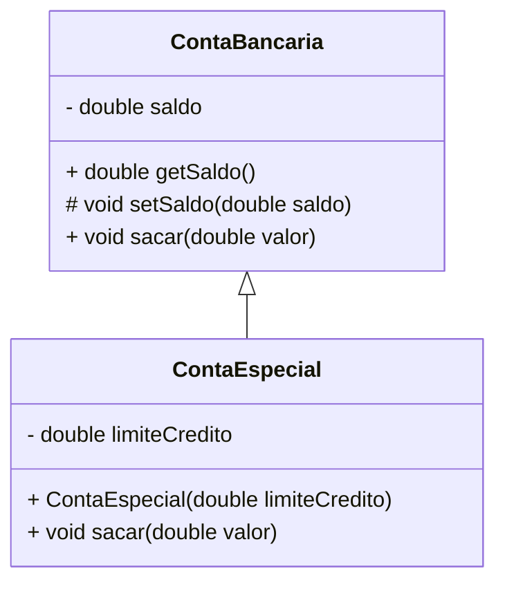

## Unidade 3 – Herança

#### Aula 14 – Herança
23/09/2025

## Conceito de Herança
- **Herança** é um relacionamento entre classes onde uma classe (subclasse) **herda atributos e métodos** de outra (superclasse).
- Permite **reutilização de código** e a criação de especializações.

Exemplo simples:
```java
class ContaBancaria {
	private double saldo;

	public double getSaldo() {
		return saldo;
	}

	protected void setSaldo(double saldo) {
		this.saldo = saldo;
    }
	
	protected void setSaldo(double saldo) {
		this.saldo = saldo;
	}

	public void sacar(double valor) {
		if (valor > saldo) {
			throw new IllegalArgumentException("Saldo insuficiênte!");
		}
		saldo -= valor;
	}
}

class ContaEspecial extends ContaBancaria {

	private double limiteCredito;

	public ContaEspecial(double limiteCredito) {
		this.limiteCredito = limiteCredito;
	}

	public void sacar(double valor) {
		if (valor > (getSaldo() + limiteCredito)) {
			throw new IllegalArgumentException("Saldo + limite insuficiênte!");
		}
		setSaldo(getSaldo()-valor);
	}
}
````

---

## Representação em UML

* A **herança** é representada por uma **seta com linha contínua** e ponta fechada apontando para a superclasse.
* Membros **protegidos** são representados com o símbolo `#`.
* Membros **privados** são representados com `-`.

Exemplo em UML:



---

## Superclasse Direta e Indireta

* **Superclasse direta**: a classe que é herdada imediatamente.
* **Superclasse indireta**: classes mais “acima” na hierarquia, herdadas de forma transitiva.

Exemplo:

```java
class Animal { }
class Mamifero extends Animal { } // superclasse direta: Animal
class Cachorro extends Mamifero { } // superclasse direta: Mamifero, indireta: Animal
```

---

## Hierarquia de Classes

* Todas as classes em Java **herdam indiretamente de `Object`**.
* Isso significa que qualquer classe pode utilizar (ou sobrescrever) métodos definidos em `Object`.

Principais métodos de `Object`:

* `toString()` → representação textual do objeto.
* `equals()` → comparação de objetos.

Exemplo:

```java
@Override
public String toString() {
    return "Conta Especial com limite: " + limiteCredito;
}

@Override
public boolean equals(Object obj) {
    if (this == obj) return true;
    if (!(obj instanceof ContaEspecial)) return false;
    ContaEspecial outra = (ContaEspecial) obj;
    return this.limiteCredito == outra.limiteCredito;
}
```

---

## Herança e Modificadores de Acesso

* **private**: acessível apenas dentro da própria classe.
* **protected**: acessível dentro da classe, subclasses e mesmo pacote.
* **public**: acessível de qualquer lugar.

👉 O uso de `protected` é útil para permitir que subclasses manipulem determinados atributos, como no exemplo de `setSaldo()`.

---

## Sobrescrita de Método

* Uma subclasse pode **reescrever** (sobrescrever) o comportamento de um método herdado.
* Deve usar a anotação `@Override` para garantir que a sobrescrita está correta.

Exemplo:

```java
@Override
public String toString() {
    return "Saldo atual: " + getSaldo();
}
```

---

## Herança de Construtores

* Construtores **não são herdados**.
* É necessário **chamar o construtor da superclasse** usando `super(...)`.

Exemplo:

```java
class ContaBancaria {
    private double saldo;

    public ContaBancaria(double saldoInicial) {
        this.saldo = saldoInicial;
    }
}

class ContaEspecial extends ContaBancaria {
    private double limite;

    public ContaEspecial(double saldoInicial, double limite) {
        super(saldoInicial); // chamada ao construtor da superclasse
        this.limite = limite;
    }
}
```