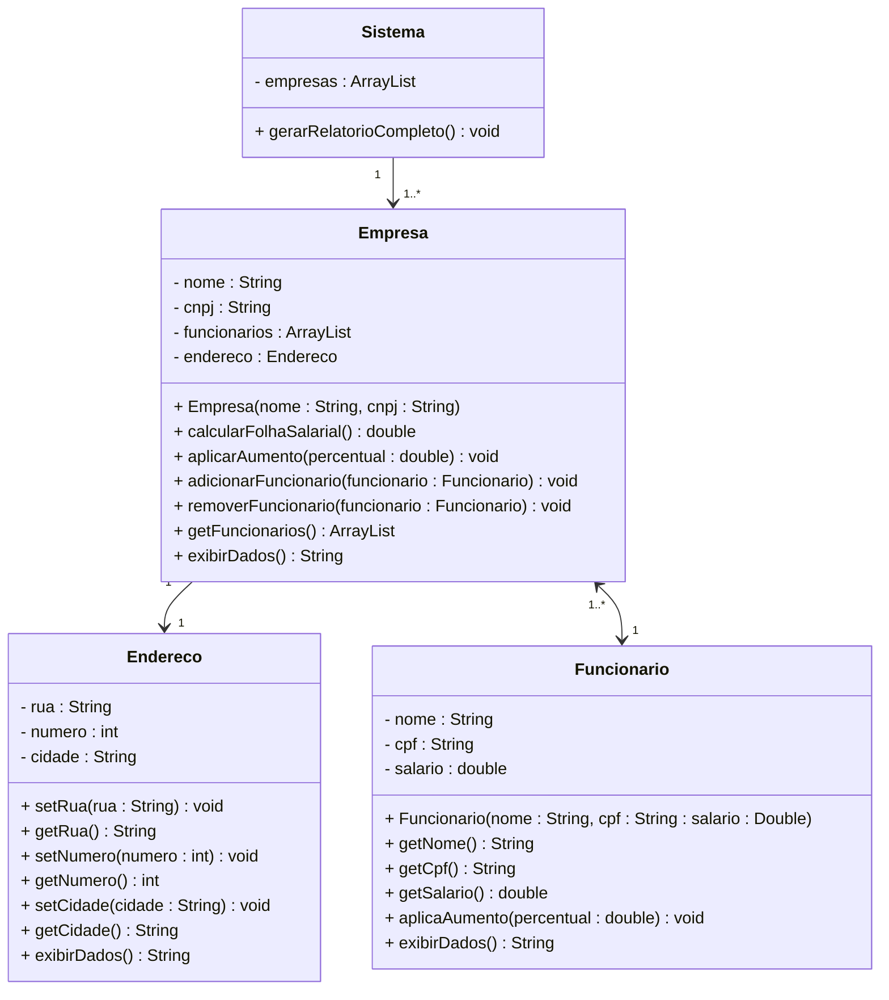

```mermaid
classDiagram
    class Sistema {
      - empresas : ArrayList<Empresa>
      + gerarRelatorioCompleto() void
    }

    class Empresa {
      - nome : String
      - cnpj : String
      - funcionarios : ArrayList<Funcionario>
      - endereco : Endereco
      + Empresa(nome : String, cnpj : String)
      + calcularFolhaSalarial() double
      + aplicarAumento(percentual : double) void
      + adicionarFuncionario(funcionario : Funcionario) void
      + removerFuncionario(funcionario : Funcionario) void
      + getFuncionarios() ArrayList<Funcionario>
      + exibirDados() String
    }

    class Funcionario {
      - nome : String
      - cpf : String
      - salario : double
      + Funcionario(nome : String, cpf : String : salario : Double)
      + getNome() String
      + getCpf() String
      + getSalario() double
      + aplicaAumento(percentual : double) void
      + exibirDados() String
    }

    class Endereco {
      - rua : String
      - numero : int
      - cidade : String
      + setRua(rua : String) void
      + getRua() String
      + setNumero(numero : int) void
      + getNumero() int
      + setCidade(cidade : String) void
      + getCidade() String
      + exibirDados() String
    }

    Sistema "1" --> "1..*" Empresa 
    Empresa "1" --> "1" Endereco
    Empresa "1..*" <--> "1" Funcionario
```