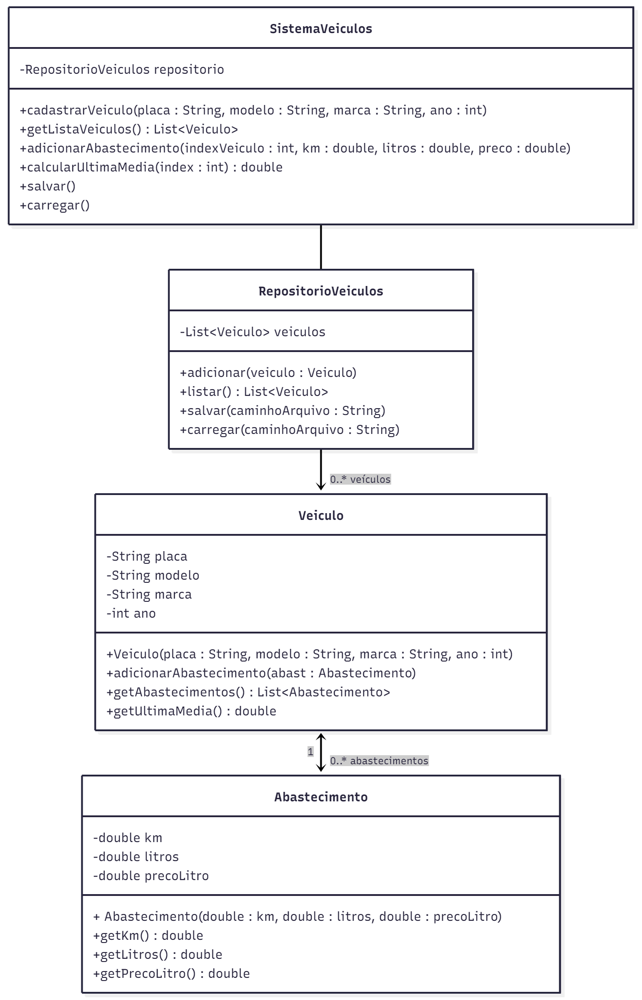

# PROVA 03 – A

Assim que receber a prova leia com muita atenção as observações abaixo.

**ATENÇÃO:** não é permitido o uso do smartphone durante a aula, nem mesmo para fotografar a prova.

- A prova é individual e sem consulta; respostas iguais serão anuladas;
- Lembre-se que a interpretação do enunciado faz parte da avaliação destas questões;
- A prova deve ser desenvolvida durante o período desta aula, e entregue até no máximo até 21:50.
- Não é permitido a utilização de nenhuma plataforma de comunicação durante a prova (e-mail, WhatsApp, Telegram, Discord, etc), se for identificada a utilização, a nota será zero.

---

## Sistema de Veículos e Registro de Abastecimentos

Você deverá implementar parte de um sistema de controle de veículos com seus abastecimentos utilizando os conceitos de POO e Swing.  
A interface gráfica, o método main e parte das classes serão fornecidas sem implementação.  
Seu trabalho será implementar todas as classes de domínio e lógica interna.

---

## Objetivo Geral do Sistema

Você deve implementar um sistema que permita:

1. **Cadastrar veículos**, contendo:
    - Placa
    - Modelo
    - Marca
    - Ano

2. **Listar os veículos cadastrados** na tabela da interface gráfica.

3. **Adicionar abastecimentos** para um veículo selecionado, onde cada abastecimento deve registrar:
    - Quilometragem total do veículo no momento do abastecimento
    - Quantidade de litros abastecidos
    - Preço por litro

   A inserção dos dados de abastecimento será feita via `JOptionPane`.

4. **Calcular a média de consumo da última abastecida**, usando a fórmula:
`média = (kmAtual – kmAnterior) / litrosDaÚltimaAbastecida`

Caso exista apenas um abastecimento, deve exibir mensagem informando que não é possível calcular a média, pois não há referência anterior.

5. **Persistir todos os dados em arquivo** (texto ou binário).  
   Ao iniciar, o sistema deve carregar os dados.  
   Ao encerrar ou cadastrar algo, deve salvar automaticamente.

---

## Estrutura de classes obrigatória

Você deverá implementar e/ou ajustar todas as classes listadas no diagrama:

- Veiculo
- Abastecimento
- RepositorioVeiculos
- SistemaVeiculos

---

## Funcionalidades e pontuações

- Classes – conforme o diagrama (**1,0 ponto**)
- Cadastrar veículos (**1,0 ponto**)
- Inserir abastecimento via JOptionPane para o registro selecionado na tabela (**2,0 pontos**)
- Calcular média da última abastecida para o registro selecionado na tabela (**2,0 pontos**)
- Salvar e carregar de arquivo (**3,0 pontos**)
- Atualizar tabela após alterações (**1,0 ponto**)

---

## Componentes da Interface Gráfica (já fornecida)

A interface terá:

### Parte superior
- Campos para cadastrar o veículo
- Botão **Adicionar Veículo**

### Parte central
- Tabela listando veículos

### Parte inferior
- Botão **Adicionar Abastecimento**
- Botão **Calcular Última Média**

A interface contém os botões e campos, mas não possui lógica.

---

## Você deve implementar:

- Classes obrigatórias
- Interação entre GUI → SistemaVeiculos
- Manipulação de listas
- Persistência
- Cálculos

---

