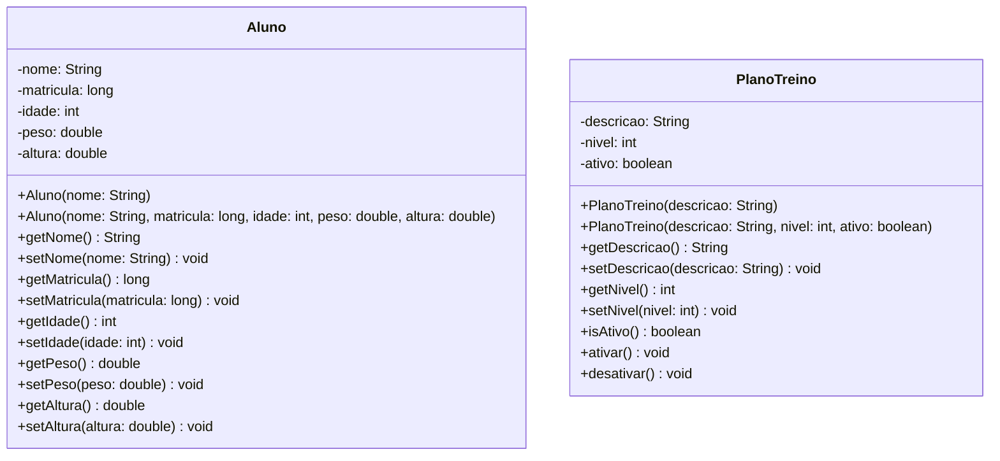

```mermaid
classDiagram
  class Aluno {
    -nome: String
    -matricula: long
    -idade: int
    -peso: double
    -altura: double
    +Aluno(nome: String)
    +Aluno(nome: String, matricula: long, idade: int, peso: double, altura: double)
    +getNome() String
    +setNome(nome: String) void
    +getMatricula() long
    +setMatricula(matricula: long) void
    +getIdade() int
    +setIdade(idade: int) void
    +getPeso() double
    +setPeso(peso: double) void
    +getAltura() double
    +setAltura(altura: double) void
  }

  class PlanoTreino {
    -descricao: String
    -nivel: int
    -ativo: boolean
    +PlanoTreino(descricao: String)
    +PlanoTreino(descricao: String, nivel: int, ativo: boolean)
    +getDescricao() String
    +setDescricao(descricao: String) void
    +getNivel() int
    +setNivel(nivel: int) void
    +isAtivo() boolean
    +ativar() void
    +desativar() void
  }
```