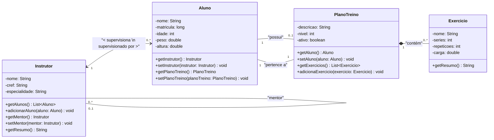

```mermaid
classDiagram
  direction LR

  class Aluno {
    -nome: String
    -matricula: long
    -idade: int
    -peso: double
    -altura: double
    +getInstrutor() Instrutor
    +setInstrutor(instrutor: Instrutor) void
    +getPlanoTreino() PlanoTreino
    +setPlanoTreino(planoTreino: PlanoTreino) void
  }

  class Instrutor {
    -nome: String
    -cref: String
    -especialidade: String
    +getAlunos() List~Aluno~
    +adicionarAluno(aluno: Aluno) void
    +getMentor() Instrutor
    +setMentor(mentor: Instrutor) void
    +getResumo() String
    %% Adicionar ligações com uma única linha e colocar o papel do mentor
  }

  class PlanoTreino {
    -descricao: String
    -nivel: int
    -ativo: boolean
    +getAluno() Aluno
    +setAluno(aluno: Aluno) void
    +getExercicios() List~Exercicio~
    +adicionaExercicio(exercicio: Exercicio) void
  }

  class Exercicio {
    -nome: String
    -series: int
    -repeticoes: int
    -carga: double
    +getResumo() String
  }

  %% --- Relacionamentos ---
  Instrutor "1" <--> "0..*" Aluno : "< supervisiona \n supervisionado por >"

  Aluno "1" -- "0..1" PlanoTreino : "possui"
  PlanoTreino "1" -- "1" Aluno : "pertence a"

  Instrutor "0..*" -- "0..1" Instrutor : "mentor"

  PlanoTreino "1" *-- "0..*" Exercicio : "contém"
```